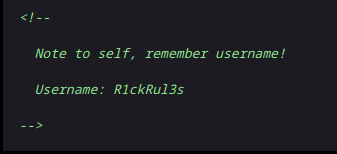
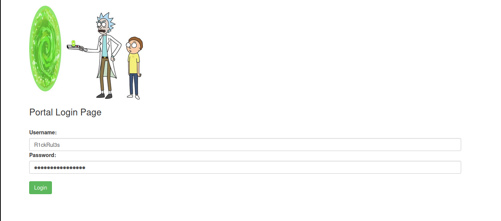
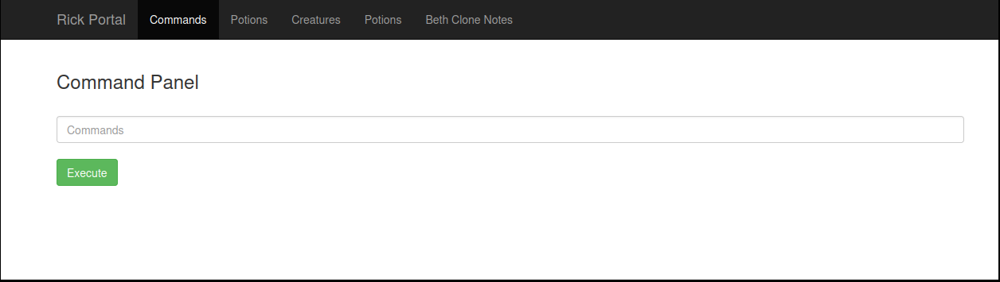

# [Pickle Rick - A Rick and Morty CTF. Help turn Rick back into a human!](https://tryhackme.com/r/room/picklerick)

## Gathering Information

### Nmap
First off, we do a basic nmap scan to find open ports.
```sh
nmap -sC -sV <IP>
```

The CTF introduction-text already stated that we have to deal with a web-application, so the output of the nmap scan is not really shocking. The open ports are:
- 22 (ssh)
- 80 (http)

### Inspecting the website
Next, I went forward to check out the website. The landing page is a pretty basic html page, so I thought it is a good idea to take a look at the source code to get a better understanding on what we have to deal with. By scanning through it, one can find a username within a comment.



Now, I wanted to see if the robots.txt file from the webserver could give me a little bit more insight, so I went to `<IP>/robots.txt`. Normally, the file tells search engine crawlers which URLs are accessable on the site, but in our case, the file just consists of one line, `Wubbalubbadubdub`. It could possibly be a password and in the best case, it is the password to the username we have already found.

## How to log in 
Assuming we found the credentials, we still need to figure out a way to use them. We need to find an attack vector. I started by doing directory enumerations to see if there are more interesting directories and files for us to look at.

### Nmap enumeration
```
user@parrot ~ $ nmap -sV --script=http-enum -p 80 <IP>
Starting Nmap 7.94SVN ( https://nmap.org ) at 2024-04-16 11:16 CEST
Nmap scan report for <IP>
Host is up (0.035s latency).

PORT   STATE SERVICE VERSION
80/tcp open  http    Apache httpd 2.4.41 ((Ubuntu))
|_http-server-header: Apache/2.4.41 (Ubuntu)
| http-enum: 
|   /login.php: Possible admin folder
|_  /robots.txt: Robots file
```
The nmap scan gives us the information we searched for. There is a `<IP>/login.php` page!

### Gobuster
Since the nmap enumeration found a .php file, I wanted to see if there are more *.php files we could use. Gobuster allows us to filter for specific filetypes, so lets do a scan for php files.
```
gobuster dir -u <IP> -w /usr/share/seclists/Discovery/Web-Content/directory-list-2.3-medium.txt -x .php
```
We get the following output:
```
/.php                (Status: 403)
/login.php           (Status: 200)
/assets              (Status: 301)[--> <IP>/assets/]
/portal.php          (Status: 302)[--> /login.php]
/.php                (Status: 403)
```
Looks like the `<IP>/login.php` will be the way to go.

### Login page 
By viewing the login page, we can clearly see that it does what the filename states: allowing a user to log in. Before looking for possible vulnerabilities, we can try the credentials we have discovered earlier.



The credentials work and we get into `<IP>/portal.php`, which allows us to just remotely execute commands, so we do not even need to bother about creating a shell.



To check if it works as expected, just run some commands to see if they give us the expected results.
- `whoami -> www-data`
- `pwd -> /var/www/html`
- `ls -> Sup3rS3cretPickl3Ingred.txt assets clue.txt denied.php index.html login.php portal.php robots.txt`

## Catching the flags
1. The file **"Sup3rS3cretPickl3Ingred.txt"** looks promising. I tried to view its content by using `cat`, but the command does not work on the target. Luckily, there is `less` as an alternative, so by running `less Sup3rS3cretPickl3Ingred.txt`, we get the first flag.

Output: XX. XXXXXXX XXXX

The directory also has a file called `clue.txt`, but the hint is not really useful.

2. We still need two more flags. I assumed there will be one user flag, within the `/home` directory of a specfic user and the other one is going to be the root flag. For the user flag, we have to check what users are available. Simply running `ls /home` tells us that there is a user named rick and `ls /home/rick` shows that the second flag is within rick's home directory called `second ingredients`. We can get the flag with `cd /home/rick && less 'second ingredients'`.

Output: X XXXXX XXXX

3. According to our assumption, the last flag is going to be the root flag, within `/root`. This means, we need to be able to execute commands as the superuser. Lets see what `sudo -l` tells us:
```
Matching Defaults entries for www-data on ip-<IP>:
    env_reset, mail_badpass, secure_path=/usr/local/sbin\:/usr/local/bin\:/usr/sbin\:/usr/bin\:/sbin\:/bin\:/snap/bin

User www-data may run the following commands on ip-<IP>:
    (ALL) NOPASSWD: ALL
```

`(ALL) NOPASSWD: ALL` means the user www-data can just directly execute commands with `sudo` as the superuser without needing a password, so all we have to do to get the root flag is `sudo less /root/3rd.txt`.

Output: 3rd ingredients: XXXXX XXXXX


